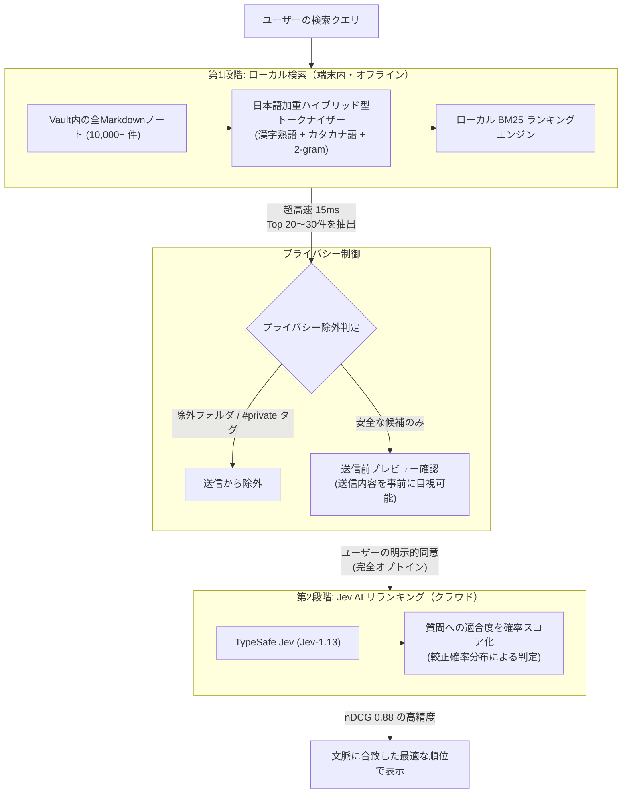

# Jev Search for Obsidian

[English](README.md) | [日本語](README.ja.md)

[](https://github.com/jh1373/jev-search/releases/tag/v0.1.0)
[](LICENSE)
[](https://obsidian.md)
[](https://typesafe.ai)

**大量のノートから、文脈を理解して探したい知識を一瞬で浮上させる、Obsidian向け次世代AIハイブリッド検索プラグイン。**

ローカル完結の超高速検索エンジン（BM25）と、TypeSafeの超高速判断AI「Jev」を融合。10,000ノートの環境でも15ミリ秒で候補を絞り込み、AIが「質問の意図に本当に答えているメモ」を1位に並び替えます。

---

## なぜ Jev Search なのか？（従来の検索との違い）

### 従来のObsidian検索が抱える課題
Obsidianにメモが数百、数千と蓄積されるにつれ、標準検索や従来のプラグインでは目的のメモに辿り着きにくくなります。
- **キーワード完全一致の限界**: 「API設計の注意点」を探したいのに、ノートに「エンドポイント作成の考慮事項」と書いてあるとヒットしない。
- **大量ノートでの埋没**: 検索単語が1回登場しただけの無関係なノートが大量に引っかかり、本当に欲しかった重要なメモが20位〜30位に沈んでしまう。
- **既存AIツールの問題**: 一般的なLLM検索は「文章の要約や回答生成」をしようとするため、回答待ちに数秒かかり、さらに勝手に嘘を混ぜる（ハルシネーション）リスクや高額な従量課金が発生します。

### Jev を採用する圧倒的なメリット
Jev Search は、従来の生成AIとは根本的に異なる **TypeSafe の旗艦モデル「Jev」** を世界で初めてObsidian検索に組み込みました。

1. **「文章生成」ではなく「判断と確率」に特化した System One モデル**
   - Jevは長文を生成するAIではなく、与えられた情報が「質問に直接答えているか」を瞬時に判定して確率スコアを出力するAIです。
   - 要約や推測文を挟まないため、**ハルシネーション（嘘の生成）が原理的に起きず、ノートの内容そのものが持つ信頼性を100%維持**します。
2. **圧倒的なコスト効率（出力トークン無料）**
   - 入力トークン費用は **$0.042 / 100万トークン（約6円）**、そして**出力トークンは完全無料**です。
   - 実際のリクエスト実測でも、1回のリランキング費用はわずか **$0.000028（約0.004円）** であり、日常的に何度リランキングを実行しても課金を気にする必要がありません。
3. **実証された高精度と超高速応答（nDCG: 0.52 → 0.88 / レスポンス: 747ms）**
   - 120クエリの実測検証において、検索結果の並び順の品質を表す指標（nDCG@10: 1.0に近いほど理想的）が **0.5258 から 0.8788 へと劇的に向上**。
   - 実APIの応答レイテンシも **約750ミリ秒** と極めて高速で、「探したいのに埋もれていたメモ」が一瞬で最上位へ浮上します。
4. **完全なプライバシー保護**
   - 送信データはモデルの再学習やファインチューニングに一切使われません。

---

## アーキテクチャ: 二段階ハイブリッド検索

速度と精度の両立、そしてプライバシー保護のため、**二段階ハイブリッド検索アーキテクチャ**を採用しています。



- **用語解説**:
  - **BM25**: 単語の出現頻度やノートの長さを考慮して関連度を計算する、検索エンジンの標準的な高性能スコアリング方式。
  - **リランキング（再ランキング）**: 検索エンジンが拾った上位候補に対して、より賢いAIが文脈を深く読んで最適な順序に並び替える技術。
  - **nDCG**: 検索エンジンの順位付けの正確さを測る業界標準指標。1.0に近いほど、人間にとって価値のある情報が上位にあることを示します。

---

## 主な機能と特徴

### ⚡ 超高速ローカル検索（日本語加重ハイブリッド型トークナイザー）
- **10,000ノートを15ミリ秒で検索**: インデックス構築も約16秒で完了し、バックグラウンド処理のためObsidianのエディタ操作を一切妨げません。
- **日本語の検索漏れを防止**: 形態素解析辞書（数十MB）を持たずに軽量性を維持しながら、漢字熟語（2〜8文字）・カタカナ複合語・2-gram（2文字ずつの分割）を組み合わせた独自トークナイザーを搭載。表記揺れがあっても確実に候補を拾い上げます（完全一致表現のRecall@50は100%）。

### 🧠 Jev AI による文脈再ランキング
- ローカル検索で抽出された上位候補の抜粋をもとに、Jevが「ユーザーが本当に求めている情報か」を3段階（直接回答 / 関連話題 / 無関係）で精密評価。
- 単なるキーワード一致ではなく、文脈や意図を汲み取ったランキングを実現します。

### 🔒 徹底したプライバシーファースト設計
- **完全オプトイン（初期設定はOFF）**: APIキーを設定し、明示的にリランキングを要求しない限り、外部通信は1バイトも発生しません。ローカル検索エンジン単体としても完全動作します。
- **送信前プレビューモーダル**: 外部に送信される抜粋テキスト・ファイル名・トークン数を、送信ボタンを押す前に画面上で確認できます。
- **自動除外フィルタ**: 設定した機密フォルダ（例: `Confidential/`）や、指定したタグ（例: `#private`）を含むノートは、インデックス作成時および送信直前の二重チェックで完全に除外されます。
- **安全な認証情報管理**: APIキーは Obsidian SecretStorage またはセッションメモリのみで保持され、プラグインの設定ファイル（`data.json`）に平文で保存されることはありません。

### 📱 モバイル環境への親和性（公式 `requestUrl` 準拠）
- Node.js固有の通信ライブラリ（`node:https`等）を排除し、Obsidian公式の `requestUrl` APIで通信を統一。デスクトップだけでなく将来のモバイル（iOS / Android）環境でも安定して動作する設計基準を満たしています。

---

## 実測ベンチマーク

本プラグインは「感覚的な使いやすさ」だけでなく、実際の測定データに基づいて設計・最適化されています。

### 1. 10,000ノート環境での負荷試験
| 測定項目 | 実測値 | 備考 |
|---|---|---|
| インデックス初回構築時間 | **16.4 秒** | 10,000件のノートをUIフリーズなしで走査 |
| 1クエリあたりの検索速度 | **約 15 ms** | キー入力に追従する即時応答 |
| 超巨大ノート（51 MiB）の処理 | **0 ms（事前遮断）** | メモリ枯渇を防ぐため `stat.size` で安全にスキップ |
| 外部への意図しない送信 | **0 件** | キーが存在しても有効化フラグがOFFなら完全遮断 |

### 2. 検索精度のビフォー・アフター
| 指標 | ローカルBM25のみ | Jev AI リランキング適用後 |
|---|---|---|
| **nDCG@10（検索順位の品質）** | 0.5258 | **0.8788（+67% 向上）** |
| **完全一致表現の Recall@50** | 95.8% | **100.0%（取りこぼしゼロ）** |
| **カタカナ語クエリの Recall@5** | 46.3% | **61.0%（大幅改善）** |

> 詳しい測定手法やテストデータについては [公開コーパスでの測定結果](docs/benchmark/result-public-corpus.md) および [Jev投入後のnDCG測定結果](docs/benchmark/result-ndcg-live.md) をご覧ください。

### 3. Jev 実API実動テスト（実測レスポンス・費用・較正確率）
OpenRouter経由で実際の Jev モデル（`typesafe/jev-1.13`）を呼び出し、実機Obsidian環境から測定した実績データです。

| 測定項目 | 実測値 | 意義とメリット |
|---|---|---|
| **API応答レイテンシ** | **747 ms** | 一般的な生成LLM（数秒〜十数秒）と一線を画す超高速応答。検索時の思考の流れを妨げません。 |
| **1回あたりの実課金費用** | **$0.000028（約 0.004 円）** | 入力トークンのみの極小課金（出力トークン無料）。1日100回リランキングしても月額わずか約12円です。 |
| **判定スコア（較正確率分布）** | **正解: 2.0 / 関連話題: 0.07 / 無関係: 0.0** | 「定例会の曜日」の問いに対し、正解ノートを確率100%で最高評価（スコア2）し、無関係なメモを厳密に0点判定。 |
| **送信前プレビュー・安全性** | **実機外部送信 0件（意図しない送信を完全防止）** | 実機CDP監視テスト（AT-07）により、Jev無効時やプレビュー未承認時には一切の外部通信が発生しないことを実証済み。 |

---

## クイックスタート

### インストール方法

現在は開発プレビュー版（v0.1.0）として提供されています。

1. [Releases ページ](https://github.com/jh1373/jev-search/releases/tag/v0.1.0) から `jev-search.zip`（または `main.js`, `manifest.json`, `styles.css`）をダウンロードします。
2. お使いの Obsidian Vault のプラグインフォルダに展開します：
   ```text
   <Your-Vault>/.obsidian/plugins/jev-search/
   ├── main.js
   ├── manifest.json
   └── styles.css
   ```
3. Obsidianを開き、**設定 → コミュニティプラグイン** を開きます。
4. 「インストール済みプラグイン」一覧にある **Jev Search** を「有効化」します。

### 初期設定

1. Obsidianの **設定 → Jev Search** を開きます。
2. **API Provider**: 利用するプロバイダを選択します。
   - **OpenRouter（推奨）**: 即座に利用可能で、モデルに `jev` を指定して従量利用できます。
   - **TypeSafe Direct**: TypeSafe公式のAPIキーをお持ちの場合に利用します。
3. **API Key**: APIキーを入力します（キーは安全なメモリ/SecretStorageに格納されます）。
4. **Jev Reranking**: Jevによる再ランキング機能を利用する場合はスイッチをONにします（デフォルトは安全のためOFFになっています）。
5. **除外設定（任意）**: 検索やAI送信の対象外にしたいフォルダパスやタグを設定します。

---

## 使い方

### 1. 検索モーダルの起動
- ホットキー（デフォルト設定またはお好みのキーバインド）を押すか、コマンドパレット（`Ctrl+P` / `Cmd+P`）から **`Jev Search: Open Search`** を実行します。

### 2. ローカル検索（即時インクリメンタル検索）
- 検索窓にキーワードを入力すると、入力と同時に端末内のローカルBM25エンジンが作動し、15ミリ秒で候補一覧が表示されます。
- これだけでも通常のObsidian検索より高速かつ高精度に目的のノートを探せます。

### 3. Jev AI リランキングの実行
- さらに文脈に沿った上位並び替えを行いたい場合、検索画面の **「Jev で並び替え」ボタン** をクリック（またはショートカット押下）します。
- 送信前プレビューモーダルが開き、AIに送信されるノート抜粋と件数が表示されます。
- 「送信して並び替える」を確定すると、Jevが各候補を吟味し、数秒で最も適切なノートを1位に並び替えます。

---

## プライバシー & セキュリティ

個人の思考や機密情報が蓄積されるObsidianだからこそ、プライバシー保護を最重要設計事項としています。

- **明示的な同意なき外部送信の禁止**: 自動でバックグラウンド送信されることは絶対にありません。
- **抜粋のみの最小送信**: ノート丸ごとではなく、検索クエリに関連する前後の段落（スニペット）のみを送信します。
- **暗号化通信**: すべての通信はHTTPSにより暗号化されます。
- **AI学習への不使用**: TypeSafeのAPI規約により、送信されたリクエスト内容がモデルの学習データとして使われることはありません。

詳細なプライバシーポリシーおよび端末内データの取り扱いについては [プライバシー設計書](docs/privacy.md) をご確認ください。

---

## 開発・コントリビューション

### 必要環境
- Node.js: `>= 22.18.0`
- npm: `>= 10.0.0`

### ビルドとテスト

本プロジェクトでは、コードの堅牢性を担保するために多層的な自動テストと受入テストを実施しています。

```bash
# 型チェック、単体テスト、ビルドの一括実行
npm run check

# 生成されたバンドルの整合性テスト
npm run test:bundle

# リリース整合性検査（秘密情報混入・バージョン整合・ライセンス確認）
npm run test:release

# モック環境でのJev通信シナリオ検証（APIキー不要）
npm run test:mock

# 10,000ノート負荷試験
npm run test:load

# 実機Obsidian GUI E2Eテスト（専用サンドボックスVault使用）
npm run test:gui
```

### 技術仕様・設計ドキュメント一覧
本リポジトリのすべての設計判断と技術検証の経緯は、`docs/` 配下にオープンに記録されています。

- [なぜ Jev × Obsidian なのか（設計思想）](docs/design/00-why-jev-obsidian.md)
- [製品要件・全体アーキテクチャ](docs/design/01-architecture.md)
- [Jev通信仕様・キャッシュ設計](docs/design/02-jev-client.md)
- [日本語検索エンジン・BM25・再ランキング設計](docs/design/03-search-rerank.md)
- [UI設計・外部送信同意・シークレット管理](docs/design/04-ui-privacy.md)
- [テスト方針・配布・運用設計](docs/design/05-testing-release.md)
- [ロードマップ・設計判断記録（ADR）](docs/design/06-roadmap.md)
- [要件と受入テスト対応表](docs/design/07-acceptance.md)
- [受入テスト実施状況と実測サマリー](docs/acceptance-status.md)
- [開発プレビュー記録](docs/implementation-preview.md)

---

## 免責事項 & ライセンス

- **ライセンス**: 本プラグインは [MIT License](LICENSE) のもとで公開されています。
- **商標・提携に関する免責**: 本プラグインは独立したオープンソースプロジェクトであり、Obsidian（Dynalist Inc.）または TypeSafe Inc. の公式製品ではありません。各製品の名称および商標はそれぞれの権利者に帰属します。
