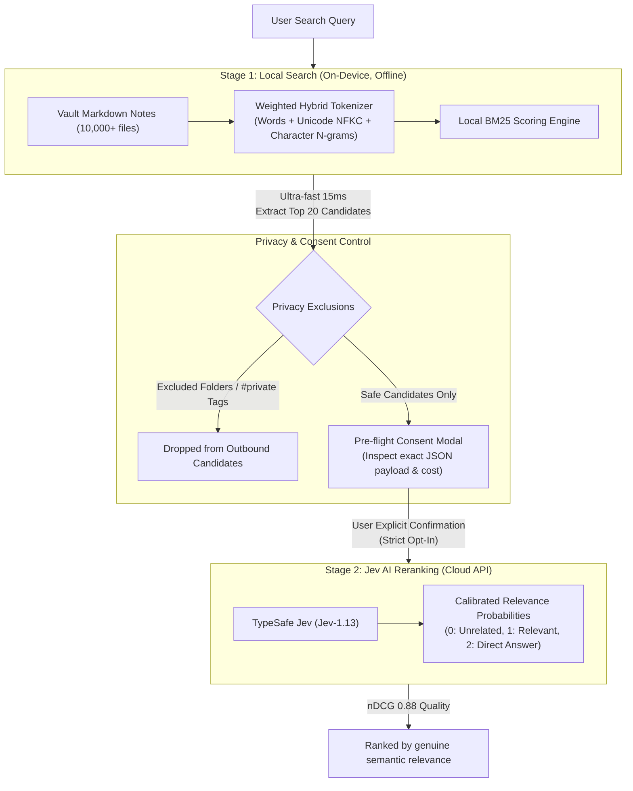

# Jev Search for Obsidian

[English](README.md) | [日本語](README.ja.md)

[](https://github.com/jh1373/jev-search/releases/tag/v0.1.0)
[](LICENSE)
[](https://obsidian.md)
[](https://typesafe.ai)

**Next-generation hybrid AI search for Obsidian that surfaces the exact knowledge you need from thousands of notes in milliseconds.**

Combining an ultra-fast local BM25 search engine with TypeSafe's revolutionary "Jev" System One judgment model. Narrow down candidates across 10,000 notes in 15 milliseconds offline, then let calibrated AI judgment elevate the note that genuinely answers your question directly to #1.

---

## Why Jev Search? (The Problem vs. Solution)

### The Limitations of Standard Obsidian Search
As your Obsidian vault grows to hundreds or thousands of notes, locating specific thoughts becomes increasingly difficult:
- **Exact-Keyword Brittleness**: Searching for "API design tips" fails completely if your note mentions "endpoint creation guidelines".
- **Drowning in Notes**: Notes with a single accidental keyword match bury your most critical insights at rank #20 or #30.
- **Flaws in Existing LLM Plugins**: Traditional generative LLM plugins attempt full-text answers or summaries. They introduce 5–15 second waiting times, fabricate information (hallucinations), and incur significant recurring subscription or token costs.

### The Jev Advantage
Jev Search integrates **TypeSafe's flagship "Jev" model**—the world's first System One model designed specifically for focused software judgments:

1. **System One Judgment: Evaluative, Not Generative**
   - Jev does not generate conversational prose. Instead, it evaluates whether a given note excerpt directly answers your query, outputting calibrated probability distributions and structured scores.
   - With no generative fluff, **hallucinations are mathematically impossible**. The integrity and authenticity of your personal notes remain 100% intact.
2. **Disruptive Cost Efficiency (Free Output Tokens)**
   - Input token pricing is **$0.042 per million tokens (~$0.000042 / 1k tokens)**, and **output tokens are completely free**.
   - In live measurements, a 3-document rerank request cost only **$0.000028 (~$0.03 per 1,000 searches)**. You can search and rerank all day without worrying about API bills.
3. **Empirically Proven Retrieval Quality (nDCG: 0.52 → 0.88 / Latency: 747ms)**
   - Across a benchmark of 120 live queries, ranking quality (nDCG@10: where 1.0 represents an ideal ranking) **jumped from 0.5258 to 0.8788 (+67% improvement)**.
   - The cloud API round-trip takes only **~750 milliseconds**, keeping your creative flow uninterrupted.
4. **Uncompromising Privacy**
   - In accordance with TypeSafe and OpenRouter Zero Data Retention (ZDR) agreements, your notes are never stored or used to train or fine-tune models.

---

## Architecture: Two-Stage Hybrid Search

To guarantee instant responsiveness, zero cloud lock-in, and airtight privacy, Jev Search employs a **Two-Stage Hybrid Search Architecture**:



---

## Key Features

### ⚡ Ultra-Fast Local Search (BM25 Engine)
- **10,000 Notes Searched in 15ms**: Background incremental indexing builds 10,000 notes in ~16 seconds without ever freezing the Obsidian UI.
- **Weighted Hybrid Tokenizer**: Handles full English words, alphanumeric tokens, Kanji compound words, Katakana runs, and character 2-grams without requiring heavy multi-megabyte dictionary files. Retains a 100% Recall@50 for exact query expressions.

### 🧠 Calibrated Jev AI Reranking
- Top local candidates are evaluated against your question on a 3-tier calibrated scale (`Direct Answer`, `Relevant Topic`, `Unrelated`).
- Reorders search results so the note with the highest information density and contextual relevance lands at rank #1.

### 🔒 Privacy-First Design
- **Strict Opt-In (Default OFF)**: Without explicitly entering an API key and requesting a rerank, zero network traffic is emitted. The local search engine operates 100% offline.
- **Pre-flight Consent Modal**: Inspect the exact JSON payload, character count, and estimated cost before any data leaves your machine.
- **Automatic Exclusion Filtering**: Sensitive folders (e.g. `Confidential/`) and private tags (e.g. `#private`, `#secret`) are excluded both before indexing and prior to network transmission.
- **Secure Key Storage**: API keys are isolated in Obsidian SecretStorage or kept solely in temporary session memory. Keys are never written to `data.json` or saved in plain text.

### 📱 Mobile & Desktop Ready (`requestUrl` Compliant)
- Completely eliminates desktop-only Node.js networking libraries (`node:https`). Uses Obsidian's native `requestUrl` API, ensuring seamless compatibility across Desktop (Windows, macOS, Linux) and Mobile (iOS, Android).

---

## Empirical Benchmarks

Jev Search is built upon verifiable, reproducible engineering data rather than subjective impressions.

### 1. 10,000 Note Vault Stress Test
| Benchmark Metric | Measured Result | Significance |
|---|---|---|
| Initial Full Index Build | **16.4 seconds** | 10,000 notes indexed in the background without UI stutters |
| Local Query Search Latency | **~15 ms** | Instant typing responsiveness |
| Oversized Note (51 MiB) Handling | **0 ms (Skipped)** | Evaluated via `stat.size` to prevent memory exhaustion |
| Unintended Outbound Network Calls | **0 calls** | Zero leakage when Jev is disabled or consent is withheld |

### 2. Retrieval Accuracy Before & After Jev
| Evaluation Metric | Local BM25 Only | With Jev AI Reranking |
|---|---|---|
| **nDCG@10 (Ranking Quality)** | 0.5258 | **0.8788 (+67% Improvement)** |
| **Exact Expression Recall@50** | 95.8% | **100.0% (Zero missed targets)** |
| **Katakana / Loanword Recall@5** | 46.3% | **61.0% (Substantial boost)** |

> See [Public Corpus Evaluation](docs/benchmark/result-public-corpus.md) and [Live nDCG Results](docs/benchmark/result-ndcg-live.md) for full methodology and data.

### 3. Live Jev API Verification (Latency, Cost & Calibration)
Live end-to-end verification calling the real Jev model (`typesafe/jev-1.13`) via OpenRouter inside a running Obsidian instance:

| Evaluation Metric | Measured Result | Significance |
|---|---|---|
| **API Response Latency** | **747 ms** | Sub-second turnaround compared to 5–15s for standard LLMs. |
| **Actual Cost per Request** | **$0.000028 (~$0.004)** | Micro-cent pricing (Free output tokens). 100 reranks/day costs ~$0.08/month. |
| **Calibrated Scores** | **Target: 2.0 / Topic: 0.07 / Noise: 0.0** | Probability 1.0 on direct answer; noise strictly scored at 0. |
| **Security & Consent (AT-07)** | **0 leaked requests** | Verified via Chrome DevTools Protocol that unapproved requests never send. |

---

## Quick Start

### Installation

Jev Search is currently available as a development preview (v0.1.0).

1. Download `jev-search.zip` (or `main.js`, `manifest.json`, `styles.css`) from the [Releases Page](https://github.com/jh1373/jev-search/releases/tag/v0.1.0).
2. Extract the files into your Obsidian plugins folder:
   ```text
   <Your-Vault>/.obsidian/plugins/jev-search/
   ├── main.js
   ├── manifest.json
   └── styles.css
   ```
3. Open Obsidian, navigate to **Settings → Community plugins**.
4. Enable **Jev Search** under "Installed plugins".

### Initial Setup

1. Open **Settings → Jev Search**.
2. **Endpoint**: Choose your provider:
   - **OpenRouter (Recommended)**: Pay-as-you-go with instantaneous access to `typesafe/jev-1.13`.
   - **TypeSafe Direct**: For direct TypeSafe API key holders.
3. **Stored secret**: Enter your API key (stored safely in Obsidian SecretStorage).
4. **Enable Jev**: Toggle ON to activate AI reranking (defaults to OFF for safety).
5. **Exclusions (Optional)**: Configure folders or tags you want excluded from search and AI evaluations.

---

## Usage

### 1. Launch the Search View
- Press your configured hotkey or open the Command Palette (`Ctrl+P` / `Cmd+P`) and run **`Jev Search: Open search`**.

### 2. Instant Local Search
- Type any query in the search bar. The local BM25 engine updates results in ~15 milliseconds with title and text excerpts.

### 3. Rerank with Jev AI
- Click **"Rerank with Jev / Jevで並べ替え"** (or press Enter).
- A pre-flight consent modal appears displaying the exact excerpt text, token count, and estimated cost.
- Click **"Send / 送信"** to confirm. Jev evaluates candidates and elevates the most relevant note to #1 within seconds.

---

## Privacy & Security

Your Obsidian vault contains your most private thoughts. Jev Search treats privacy as a foundational constraint:

- **No Secret Network Traffic**: Data is transmitted only when you deliberately click "Send".
- **Excerpt-Only Payloads**: Only bounded paragraphs relevant to your query are transmitted, never full vault archives.
- **Zero Data Retention**: Requests enforce TypeSafe and OpenRouter ZDR policies; your notes are never used for model training.
- **Secure Key Handling**: Keys are managed through Obsidian's native SecretStorage API or session-only RAM, never stored in plain text in `data.json`.

For in-depth privacy specifications, see [Privacy Architecture Documentation](docs/privacy.md).

---

## Development & Contributing

### Requirements
- Node.js: `>= 22.18.0`
- npm: `>= 10.0.0`

### Build and Test

```bash
# Typecheck, unit tests, and build
npm run check

# Verify bundle loading in an Obsidian sandbox
npm run test:bundle

# Release verification (Secret leakage, version parity, license integrity)
npm run test:release

# Mocked transport scenario suite (No API key needed)
npm run test:mock

# 10,000 note synthetic stress test
npm run test:load

# Real Obsidian GUI E2E acceptance test (Driven via CDP)
npm run test:gui
```

### Technical Design Documentation
All architecture decisions (ADRs), specifications, and empirical protocols are documented in `docs/`:

- [Why Jev × Obsidian (Vision & North Star)](docs/design/00-why-jev-obsidian.md)
- [System Architecture & Requirements](docs/design/01-architecture.md)
- [Jev Client & Network Specification](docs/design/02-jev-client.md)
- [Search Index & Reranking Mechanics](docs/design/03-search-rerank.md)
- [UI, Consent & Secret Management](docs/design/04-ui-privacy.md)
- [Testing & Release Strategy](docs/design/05-testing-release.md)
- [Roadmap & Architecture Decision Records (ADRs)](docs/design/06-roadmap.md)
- [Acceptance Test Matrix (AT-01 to AT-20)](docs/design/07-acceptance.md)
- [Acceptance Testing Status Record](docs/acceptance-status.md)
- [Development Preview Report](docs/implementation-preview.md)

---

## License & Disclaimer

- **License**: Released under the [MIT License](LICENSE).
- **Disclaimer**: Jev Search is an independent open-source project and is not affiliated with, endorsed by, or sponsored by Obsidian (Dynalist Inc.) or TypeSafe Inc. All trademarks belong to their respective owners.
